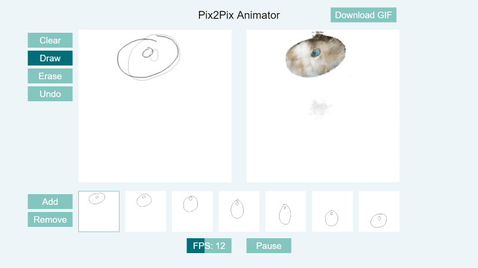

# Pix2Pix Animator

Browser-based animation program that uses AI to try to generate realistic images from sketches

Uses models from https://github.com/zaidalyafeai/zaidalyafeai.github.io/tree/master/pix2pix

## Running
The lastest version will be hosted on Github [here](https://parameterized.github.io/pix2pix-animator).

If you want to modify the code, install the dependencies (`npm install`) then `npm run dev-server` to start the webpack development server.

## Controls
- D - Draw
- E - Erase
- Ctrl + Z - Undo
- Right Arrow - Next frame
- Left Arrow - Last frame
- Space - Play/pause animation
- N - New frame